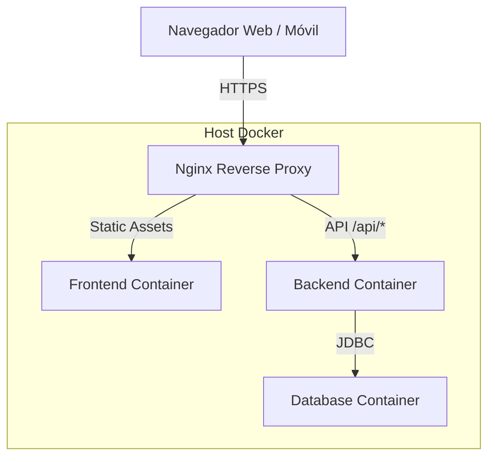

# Arquitectura General INATrace

> **Audiencia**: Arquitectos, Desarrolladores Senior, Stakeholders Técnicos  
> **Basado en**: Modelo arc42  
> **Última actualización**: Noviembre 2025

Este documento describe la arquitectura de software de INATrace, un sistema de trazabilidad basado en blockchain para cadenas de valor agrícola.

---

## 1. Introducción y Objetivos

INATrace es una plataforma de código abierto diseñada para proporcionar transparencia, confianza y equidad en las cadenas de suministro agrícola (como café, cacao y camarón). Permite a todos los actores, desde el productor hasta el consumidor final, registrar y visualizar el recorrido del producto.

### 1.1 Objetivos de Calidad

| Prioridad | Atributo | Motivación |
|-----------|----------|------------|
| 1 | **Integridad** | Los datos de trazabilidad deben ser inmutables y verificables (Blockchain). |
| 2 | **Interoperabilidad** | Debe integrarse con sistemas externos (ERP, IoT, Beyco). |
| 3 | **Usabilidad** | Interfaz accesible para agricultores en zonas rurales y operadores en planta. |
| 4 | **Adaptabilidad** | Soporte para múltiples productos (Multi-Cadena) sin reescribir código. |

### 1.2 Stakeholders

| Rol | Interés |
|-----|---------|
| **Agricultores** | Registrar entregas y recibir pagos justos. |
| **Cooperativas** | Gestionar acopio, procesamiento y logística. |
| **Compradores** | Verificar origen y calidad del producto. |
| **Consumidores** | Conocer la historia del producto mediante QR. |
| **Desarrolladores** | Extender y mantener el sistema. |

---

## 2. Restricciones de Arquitectura

### 2.1 Técnicas
- **Backend**: Java 17 + Spring Boot (Estándar empresarial).
- **Frontend**: Angular 10+ (SPA robusta).
- **Base de Datos**: MySQL 8.0 (Relacional principal).
- **Blockchain**: Hyperledger Fabric (Opcional, para inmutabilidad).
- **Despliegue**: Contenedores Docker orquestados (Docker Compose / K8s).

### 2.2 Organizacionales
- Licencia **Open Source** (AGPL para backend, MIT para documentación).
- Documentación y UI disponibles en **Español** e Inglés.
- Enfoque **Mobile-First** para operaciones de campo.

---

## 3. Contexto y Alcance

### 3.1 Contexto de Negocio

INATrace actúa como el núcleo de información de la cadena de suministro, conectando actores físicos con flujos digitales.

**Diagrama de Contexto (C4 Nivel 1)**

```mermaid
graph TD
    User[Usuario / Actor de Cadena]
    Consumer[Consumidor Final]
    
    subgraph "Sistema INATrace"
        INATrace[Plataforma INATrace]
    end
    
    ExternalAuth[Servicio de Email / SMS]
    Beyco[Plataforma Beyco (Trading)]
    Maps[Mapbox / Google Maps]
    Rates[Exchange Rates API]
    
    User -->|Registra/Consulta| INATrace
    Consumer -->|Escanea QR| INATrace
    
    INATrace -->|Envía Notificaciones| ExternalAuth
    INATrace -->|Sincroniza Ofertas| Beyco
    INATrace -->|Visualiza Geolocalización| Maps
    INATrace -->|Consulta Tipos de Cambio| Rates
```

---

## 4. Estrategia de Solución

### 4.1 Decisiones Clave

1. **Arquitectura Monolítica Modular (Backend)**:
   - Se eligió un monolito bien estructurado (Modular Monolith) en lugar de microservicios puros para simplificar el despliegue y mantenimiento en organizaciones con recursos limitados.
   - Módulos claros: `User`, `Product`, `StockOrder`, `Payment`.

2. **Single Page Application (Frontend)**:
   - Angular permite una experiencia fluida y gestión compleja de formularios (wizards, validaciones) necesaria para los procesos de acopio y transformación.

3. **Multi-Tenancy Lógico**:
   - Aislamiento de datos por `CompanyID` en la misma base de datos.
   - Permite alojar múltiples cooperativas en una sola instancia de infraestructura.

4. **Blockchain Híbrido**:
   - La base de datos relacional (MySQL) es la fuente de verdad operativa (rápida, flexible).
   - Blockchain (Hyperledger) actúa como capa de notariado digital (hash anchoring) para datos críticos, garantizando que no hayan sido alterados.

---

## 5. Vista de Bloques de Construcción

### 5.1 Diagrama de Contenedores (C4 Nivel 2)



### 5.2 Componentes Principales

#### Backend (Spring Boot)
- **API Layer**: Controladores REST documentados con OpenAPI.
- **Service Layer**: Lógica de negocio (validaciones, cálculos de merma, trazabilidad).
- **Persistence Layer**: Spring Data JPA + Hibernate.
- **Security**: Spring Security + JWT.

#### Frontend (Angular)
- **Core Module**: Servicios singleton (Auth, API).
- **Shared Module**: UI Kit reutilizable.
- **Feature Modules**: Carga perezosa (Lazy Loading) por dominio (Company, Product, Settings).

---

## 6. Vista de Ejecución (Flujos Críticos)

### 6.1 Registro de Entrega (Acopio)
1. Productor llega al centro de acopio.
2. Operador busca productor en App Móvil/Web.
3. Operador registra peso bruto, humedad y calidad.
4. Sistema calcula peso neto y precio a pagar (según reglas configuradas).
5. Sistema genera **Lote de Entrada** (Batch) y asigna código único.
6. Sistema imprime recibo.

### 6.2 Transformación (Procesamiento)
1. Operador selecciona lotes de entrada (materia prima).
2. Registra parámetros de proceso (temperatura, tiempo, mermas).
3. Sistema da de baja stock de entrada y crea stock de **Producto Terminado/Semi-terminado**.
4. La trazabilidad se mantiene vinculando Lote Salida -> Lotes Entrada.

---

## 7. Despliegue e Infraestructura

### 7.1 Entornos Típicos
- **Desarrollo**: Docker Compose local.
- **Producción**: Servidor VPS (ej: Hetzner) con Docker Compose orquestado.
- **Red**: Nginx maneja SSL (Let's Encrypt) y enrutamiento.

### 7.2 Configuración Multi-Cadena
El sistema soporta despliegues paralelos para diferentes productos en el mismo servidor:
- `inatrace.example.com` -> Stack Cacao
- `shrimp.example.com` -> Stack Camarón

Cada stack tiene sus propios contenedores y base de datos para máximo aislamiento.

---

## 8. Conceptos Transversales

### 8.1 Seguridad
- **Autenticación**: JWT (Access + Refresh Tokens).
- **Autorización**: RBAC (Role Based Access Control) + ACL (Access Control List) por Empresa.
- **Datos**: Encriptación en reposo (disco) y en tránsito (TLS).

### 8.2 Internacionalización (i18n)
- Backend maneja datos maestros traducibles (ej: nombres de procesos).
- Frontend maneja literales de UI (inglés/español) con `ngx-translate`.

### 8.3 Auditoría
- **Hibernate Envers**: Historial completo de cambios en entidades críticas.
- **Logs**: Trazabilidad técnica de errores y accesos.

---

## 9. Riesgos y Deuda Técnica

| Riesgo | Impacto | Mitigación |
|--------|---------|------------|
| Complejidad de configuración inicial | Medio | Scripts de automatización y documentación detallada (esta guía). |
| Dependencia de servicios externos (mapas, tasas) | Bajo | Fallback a valores por defecto o caché local. |
| Curva de aprendizaje Angular/Spring | Medio | Arquitectura estándar y limpia, fácil de aprender para desarrolladores Java/JS. |

---

**Última actualización**: Noviembre 2025
