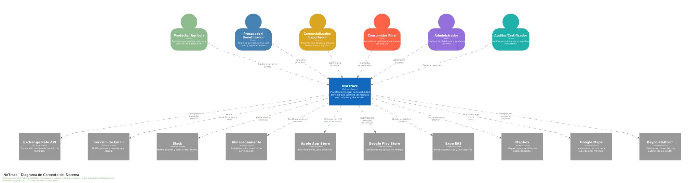

# Diagrama C4 - Nivel 1: Contexto del Sistema

> **Audiencia**: Stakeholders, Arquitectos, Gerencia  
> **Nivel C4**: Contexto (System Context)  
> **Última actualización**: Noviembre 2025

## Descripción

El diagrama de contexto muestra **INATrace** como un sistema completo y cómo interactúa con usuarios externos y sistemas externos. Este es el nivel más alto de abstracción, útil para entender el alcance y las fronteras del sistema.

---

## Diagrama

---

## Actores Principales

### 1. Usuarios Internos (Dentro de la Organización)

| Actor | Descripción | Interacciones Principales |
|-------|-------------|---------------------------|
| **Administrador del Sistema** | Configura parámetros globales, gestiona usuarios y organizaciones. | Accede al panel de administración, configura cadenas de valor. |
| **Administrador de Empresa** | Gestiona su organización: productos, usuarios, instalaciones. | CRUD de productos, asignación de roles, configuración de procesos. |
| **Operador de Campo** | Registra entregas, procesos y movimientos de stock. | Captura datos en móvil o web, imprime recibos. |
| **Productor/Agricultor** | Entrega materia prima y consulta su historial de pagos. | Ve su perfil, historial de entregas y pagos pendientes. |

### 2. Usuarios Externos (Consumidores Finales)

| Actor | Descripción | Interacciones |
|-------|-------------|---------------|
| **Consumidor Final** | Escanea código QR del producto en tienda. | Accede a página pública con historia del producto, origen, certificaciones. |

---

## Sistemas Externos

### 1. Servicios de Terceros

| Sistema | Proveedor | Propósito |
|---------|-----------|-----------|
| **Servicio de Email (SMTP)** | Gmail, SendGrid, etc. | Envío de notificaciones (registro, reset password, alertas). |
| **Servicio de Mapas** | Mapbox / Google Maps | Visualización de ubicaciones de fincas, instalaciones y rutas. |
| **API de Tasas de Cambio** | exchangeratesapi.io | Conversión de monedas para pagos internacionales. |
| **Plataforma Beyco** | Beyco.nl | Integración opcional para publicar ofertas de venta. |

### 2. Blockchain (Opcional)

| Sistema | Tecnología | Propósito |
|---------|------------|-----------|
| **Red Hyperledger Fabric** | Hyperledger Fabric | Notariado digital de eventos críticos (lotes, certificaciones) para garantizar inmutabilidad. |

---

## Flujos de Información Clave

### Flujo 1: Registro de Trazabilidad
1. **Operador** registra entrega de materia prima en **INATrace**.
2. Sistema genera lote único y almacena en **Base de Datos**.
3. (Opcional) Hash del evento se ancla en **Blockchain**.
4. Sistema envía confirmación por **Email** al productor.

### Flujo 2: Consulta Pública (QR)
1. **Consumidor** escanea QR del producto.
2. **INATrace** consulta datos de trazabilidad en **Base de Datos**.
3. Sistema muestra página pública con mapa de origen (**Mapbox**) y certificaciones.

### Flujo 3: Gestión de Pagos
1. **Administrador** registra pago a productores.
2. Sistema calcula montos usando **API de Tasas de Cambio**.
3. Genera reporte y notifica por **Email**.

---

## Fronteras del Sistema

**Dentro del alcance de INATrace**:
- Gestión de usuarios y organizaciones.
- Registro y consulta de trazabilidad.
- Procesamiento y transformación de productos.
- Generación de reportes y dashboards.
- Gestión de pagos a productores.

**Fuera del alcance** (Delegado a sistemas externos):
- Procesamiento de pagos bancarios (se registra, no se ejecuta).
- Envío físico de emails (usa SMTP externo).
- Renderizado de mapas (usa Mapbox/Google).
- Almacenamiento de blockchain (usa red Hyperledger externa).

---

## Recursos Adicionales

- [Diagrama de Contenedores (Nivel 2)](./02-contenedores.md)
- [Arquitectura General](../arquitectura-general.md)

---

**Última actualización**: Noviembre 2025
