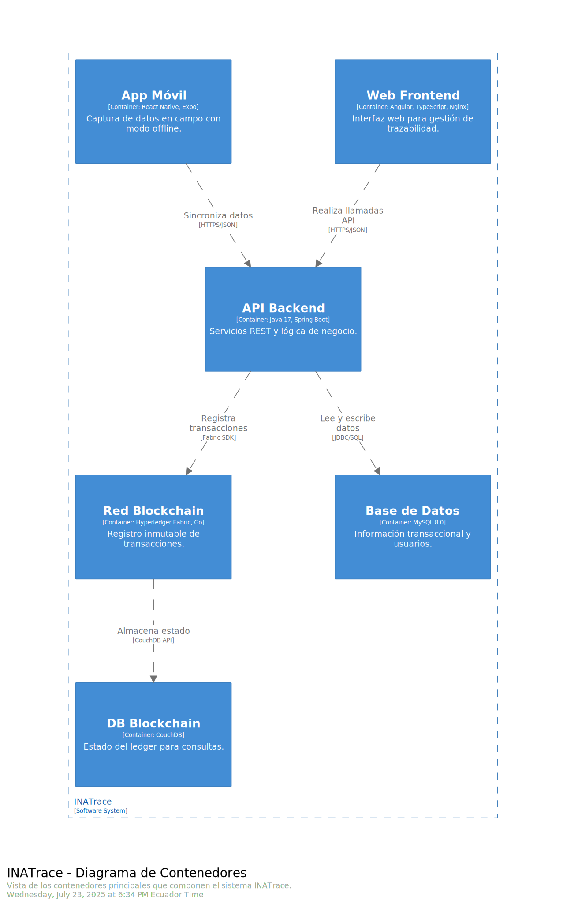
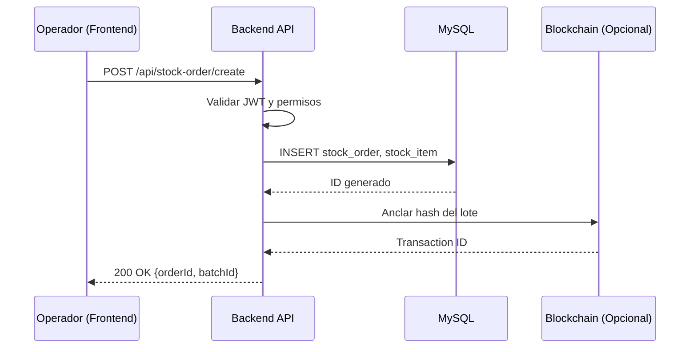
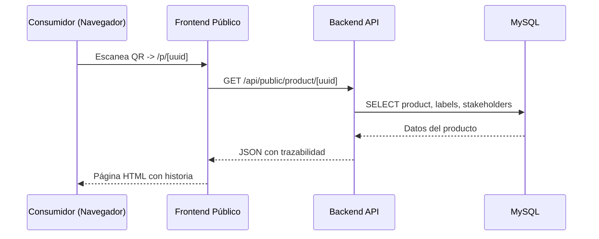

# Diagrama C4 - Nivel 2: Contenedores

> **Audiencia**: Arquitectos, Desarrolladores Senior, DevOps  
> **Nivel C4**: Contenedores (Container View)  
> **Última actualización**: Noviembre 2025

## Descripción

El diagrama de contenedores muestra las aplicaciones y almacenes de datos que componen **INATrace**. Un "contenedor" en C4 es una unidad ejecutable o almacén de datos (no confundir con contenedores Docker, aunque en este caso sí se despliegan como contenedores Docker).

---

## Diagrama



---

## Contenedores Principales

### 1. Frontend Web (Angular SPA)

| Propiedad | Detalle |
|-----------|---------|
| **Tecnología** | Angular 10, TypeScript, Nginx |
| **Puerto** | 80 (HTTP) / 443 (HTTPS) |
| **Responsabilidad** | Interfaz de usuario para operadores, administradores y gestión interna. |
| **Comunicación** | Consume API REST del Backend vía HTTPS. |

**Características**:
- Single Page Application (SPA) responsiva.
- Autenticación con JWT almacenado en cookies HTTP-Only.
- Soporte multi-idioma (ES/EN) y multi-cadena (Cacao/Camarón).

### 2. Aplicación Móvil (React Native)

| Propiedad | Detalle |
|-----------|---------|
| **Tecnología** | React Native, Expo |
| **Plataformas** | iOS, Android |
| **Responsabilidad** | Captura de datos en campo (entregas, fotos, geolocalización). |
| **Comunicación** | Consume API REST del Backend vía HTTPS. |

**Características**:
- Funciona offline con sincronización posterior.
- Escaneo de QR para identificar productores.
- Captura de fotos y GPS.

### 3. Backend API (Spring Boot)

| Propiedad | Detalle |
|-----------|---------|
| **Tecnología** | Java 17, Spring Boot 3.3, Maven |
| **Puerto** | 8080 (HTTP interno) |
| **Responsabilidad** | Lógica de negocio, autenticación, autorización, orquestación de datos. |
| **Comunicación** | Expone API REST (JSON), consume Base de Datos MySQL. |

**Características**:
- Arquitectura modular (DDD).
- Seguridad con Spring Security + JWT.
- Migraciones automáticas con Flyway.
- Documentación OpenAPI 3.0 (Swagger).

### 4. Base de Datos (MySQL)

| Propiedad | Detalle |
|-----------|---------|
| **Tecnología** | MySQL 8.0 |
| **Puerto** | 3306 |
| **Responsabilidad** | Almacenamiento persistente de datos transaccionales y maestros. |
| **Comunicación** | Accedida únicamente por el Backend vía JDBC. |

**Características**:
- Esquema relacional normalizado.
- Tablas de auditoría (`_AUD`) gestionadas por Hibernate Envers.
- Soporte para múltiples organizaciones (multi-tenancy lógico).

### 5. Red Blockchain (Hyperledger Fabric) - Opcional

| Propiedad | Detalle |
|-----------|---------|
| **Tecnología** | Hyperledger Fabric, Chaincode (Go/Node.js) |
| **Responsabilidad** | Notariado digital de eventos críticos (inmutabilidad). |
| **Comunicación** | Backend envía transacciones vía SDK de Fabric. |

**Características**:
- Usado principalmente para la cadena de **Café**.
- Almacena hashes de lotes y certificaciones.
- Consulta pública de verificación de autenticidad.

---

## Flujo de Datos Típico

### Registro de Entrega (Operador -> Sistema)



### Consulta Pública (Consumidor -> QR)



---

## Estrategia de Despliegue

Todos los contenedores se despliegan usando **Docker** y **Docker Compose**.

**Ejemplo de estructura en servidor**:
```
/opt/inatrace/
├── backend/
│   ├── docker-compose.yml
│   └── .env
├── frontend/
│   ├── docker-compose.yml
│   └── nginx.conf
└── volumes/
    ├── uploads/
    ├── documents/
    └── mysql/
```

---

## Recursos Adicionales

- [Diagrama de Contexto (Nivel 1)](./01-contexto.md)
- [Componentes del Backend (Nivel 3)](./03-componentes-backend.md)
- [Componentes del Frontend (Nivel 3)](./03-componentes-frontend.md)

---

**Última actualización**: Noviembre 2025
