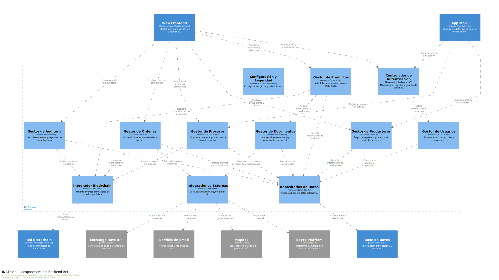
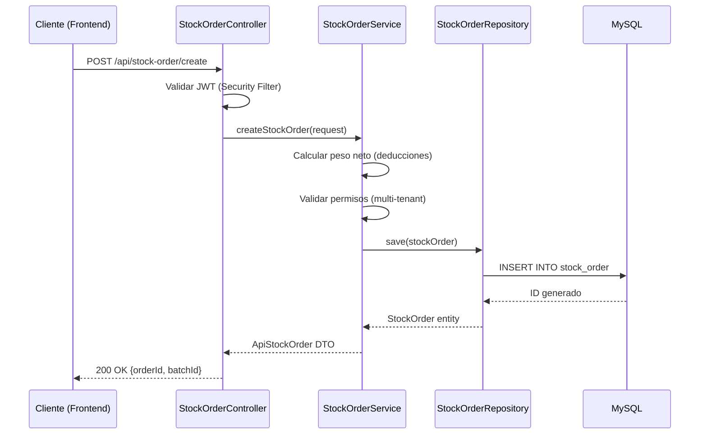

# Diagrama C4 - Nivel 3: Componentes del Backend

> **Audiencia**: Desarrolladores Backend, Arquitectos  
> **Nivel C4**: Componentes (Component View)  
> **Última actualización**: Noviembre 2025

## Descripción

Este diagrama descompone el **Backend API** en sus componentes lógicos principales, mostrando cómo se organizan las responsabilidades dentro de la aplicación Spring Boot.

---

## Diagrama

---

## Componentes Principales

### 1. API Layer (Controladores REST)

**Responsabilidad**: Exponer endpoints HTTP y validar requests.

| Componente | Endpoints Principales | Descripción |
|------------|----------------------|-------------|
| `UserController` | `/api/user/*` | Autenticación, registro, gestión de perfil. |
| `CompanyController` | `/api/company/*` | CRUD de organizaciones y configuración. |
| `ProductController` | `/api/product/*` | Gestión de productos y etiquetas QR. |
| `StockOrderController` | `/api/stock-order/*` | Órdenes de compra, venta y procesamiento. |
| `PaymentController` | `/api/payment/*` | Registro de pagos a productores. |

**Tecnología**: Spring MVC, anotaciones `@RestController`, validación con Bean Validation.

---

### 2. Service Layer (Lógica de Negocio)

**Responsabilidad**: Implementar reglas de negocio, orquestar operaciones complejas.

| Servicio | Responsabilidad |
|----------|-----------------|
| `UserService` | Gestión de usuarios, roles y autenticación JWT. |
| `CompanyService` | Multi-tenancy, configuración de empresas. |
| `ProductService` | Trazabilidad de productos, generación de QR. |
| `StockOrderService` | Cálculo de peso neto, deducciones, validaciones de stock. |
| `PaymentService` | Cálculo de balances, conversión de monedas. |

**Patrones**:
- **Transaction Management**: `@Transactional` para garantizar ACID.
- **Validation**: Lógica de negocio compleja (ej: verificar stock disponible antes de procesar).

---

### 3. Repository Layer (Acceso a Datos)

**Responsabilidad**: Abstracción de acceso a la base de datos.

| Repositorio | Entidad | Métodos Clave |
|-------------|---------|---------------|
| `UserRepository` | `User` | `findByEmail()`, `findByStatus()` |
| `CompanyRepository` | `Company` | `findByIdAndUserId()` (multi-tenant) |
| `StockOrderRepository` | `StockOrder` | `findByFacilityAndDateRange()` |
| `ProductRepository` | `Product` | `findByUuid()`, `findByCompanyId()` |

**Tecnología**: Spring Data JPA, consultas derivadas y `@Query` para casos complejos.

---

### 4. Security Component

**Responsabilidad**: Autenticación y autorización.

| Clase | Función |
|-------|---------|
| `JwtTokenProvider` | Generación y validación de tokens JWT. |
| `TokenAuthenticationFilter` | Interceptor que valida JWT en cada request. |
| `SpringSecurityConfig` | Configuración de rutas públicas/privadas. |

**Flujo de Autenticación**:
1. Usuario envía credenciales a `/api/user/login`.
2. `UserService` valida contra BD.
3. `JwtTokenProvider` genera Access Token (1h) y Refresh Token (5min).
4. Tokens se envían en cookies HTTP-Only.

---

### 5. Integration Components

**Responsabilidad**: Comunicación con sistemas externos.

| Componente | Sistema Externo | Uso |
|------------|-----------------|-----|
| `EmailService` | SMTP Server | Envío de notificaciones. |
| `ExchangeRateService` | exchangeratesapi.io | Conversión de monedas. |
| `BeycoIntegrationService` | Beyco Platform | Publicación de ofertas (opcional). |
| `BlockchainService` | Hyperledger Fabric | Anclaje de hashes (opcional). |

---

### 6. Utility Components

| Componente | Función |
|------------|---------|
| `FileStorageService` | Gestión de uploads (imágenes, PDFs). |
| `QRCodeGenerator` | Generación de códigos QR únicos. |
| `AuditService` | Registro de cambios con Hibernate Envers. |

---

## Flujo de Ejecución (Ejemplo: Crear Orden de Compra)

---

## Recursos Adicionales

- [Ficha Técnica Backend](../../backend/ficha-tecnica-backend.md)
- [Diagrama de Contenedores](./02-contenedores.md)

---

**Última actualización**: Noviembre 2025
