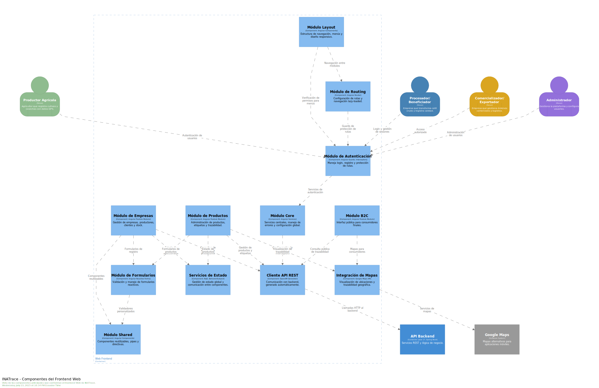
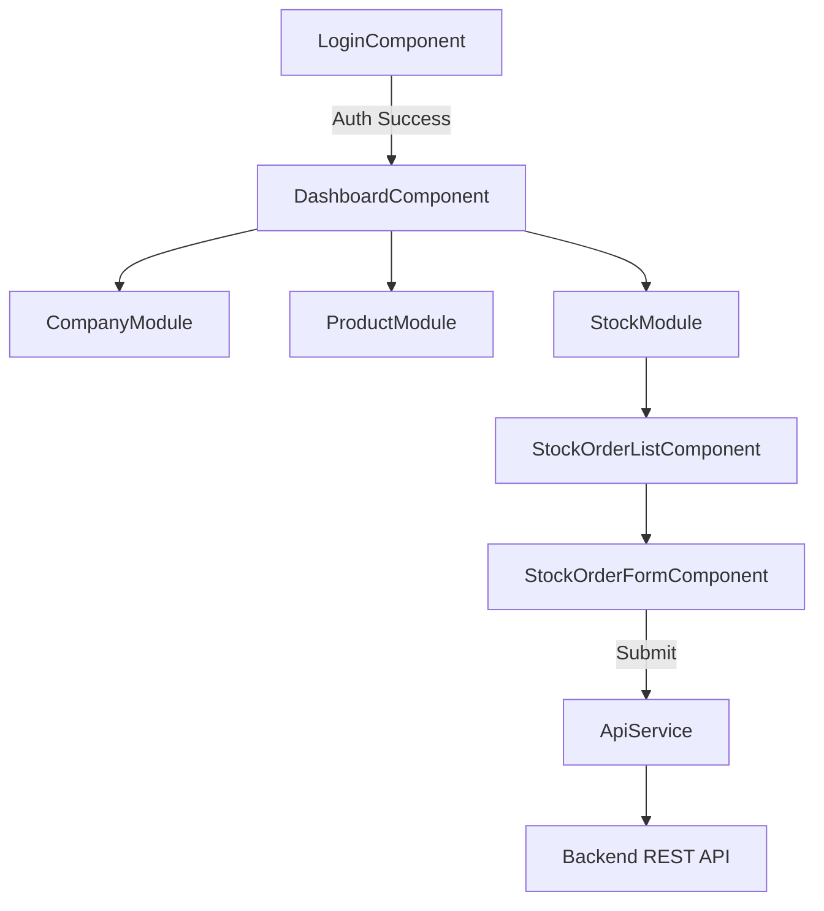

# Diagrama C4 - Nivel 3: Componentes del Frontend

> **Audiencia**: Desarrolladores Frontend, UX/UI Designers  
> **Nivel C4**: Componentes (Component View)  
> **Última actualización**: Noviembre 2025

## Descripción

Este diagrama descompone la **Aplicación Frontend (Angular)** en sus módulos y componentes principales, mostrando la arquitectura de la interfaz de usuario.

---

## Diagrama



---

## Módulos Principales

### 1. Core Module (Singleton)

**Responsabilidad**: Servicios globales que se instancian una sola vez.

| Servicio | Función |
|----------|---------|
| `AuthService` | Gestión de autenticación (login, logout, refresh token). |
| `ApiService` | Cliente HTTP centralizado para llamadas al backend. |
| `ErrorHandlerService` | Manejo global de errores HTTP. |
| `StorageService` | Abstracción de localStorage/sessionStorage. |

**Importación**: Solo en `AppModule` (una vez).

---

### 2. Shared Module (Reutilizable)

**Responsabilidad**: Componentes UI, pipes y directivas compartidas.

| Componente/Directiva | Uso |
|----------------------|-----|
| `TextInputComponent` | Input de texto con validación visual. |
| `ButtonComponent` | Botón estilizado con estados (loading, disabled). |
| `TableComponent` | Tabla genérica con paginación y ordenamiento. |
| `ModalComponent` | Diálogo modal reutilizable. |
| `HasRoleDirective` | Directiva estructural para mostrar/ocultar según rol. |

**Importación**: En cada módulo de feature que lo necesite.

---

### 3. Layout Module

**Responsabilidad**: Estructura visual de la aplicación.

| Componente | Descripción |
|------------|-------------|
| `HeaderComponent` | Barra superior con logo, navegación y menú de usuario. |
| `SidebarComponent` | Menú lateral con accesos rápidos. |
| `FooterComponent` | Pie de página con información legal. |

---

### 4. Feature Modules (Lazy Loaded)

Módulos de negocio cargados bajo demanda para optimizar el tiempo de carga inicial.

#### 4.1 Auth Module
- **Ruta**: `/auth/*`
- **Componentes**:
  - `LoginComponent`: Formulario de login.
  - `RegisterComponent`: Registro de nuevos usuarios.
  - `ResetPasswordComponent`: Recuperación de contraseña.

#### 4.2 Dashboard Module
- **Ruta**: `/dashboard`
- **Componentes**:
  - `DashboardComponent`: Vista principal con widgets.
  - `DeliveryChartComponent`: Gráfico de entregas por periodo.
  - `ProcessingPerformanceComponent`: Rendimiento de procesamiento.

#### 4.3 Company Module
- **Ruta**: `/company/*`
- **Componentes**:
  - `CompanyProfileComponent`: Edición de datos de la empresa.
  - `UserManagementComponent`: Gestión de usuarios y roles.
  - `FacilityListComponent`: Lista de instalaciones.

#### 4.4 Product Module
- **Ruta**: `/product/*`
- **Componentes**:
  - `ProductListComponent`: Listado de productos.
  - `ProductDetailComponent`: Edición de producto.
  - `QRLabelGeneratorComponent`: Generación de etiquetas QR.

#### 4.5 Stock Module
- **Ruta**: `/stock/*`
- **Componentes**:
  - `StockOrderListComponent`: Listado de órdenes.
  - `StockOrderFormComponent`: Formulario de creación/edición.
  - `ProcessingActionComponent`: Registro de transformaciones.

---

## Flujo de Navegación



---

## Gestión de Estado

INATrace utiliza **RxJS** y **Observables** para gestión reactiva de estado.

| Patrón | Implementación |
|--------|----------------|
| **BehaviorSubject** | Para estado compartido (ej: usuario actual, empresa activa). |
| **Async Pipe** | Suscripción automática en templates. |
| **Interceptors** | Para inyectar JWT en headers y manejar errores globalmente. |

**Ejemplo**:
```typescript
// auth.service.ts
private currentUserSubject = new BehaviorSubject<User>(null);
public currentUser$ = this.currentUserSubject.asObservable();

login(credentials) {
  return this.api.post('/user/login', credentials).pipe(
    tap(user => this.currentUserSubject.next(user))
  );
}
```

---

## Internacionalización (i18n)

Sistema multi-idioma con soporte multi-cadena.

| Archivo | Descripción |
|---------|-------------|
| `assets/locale/es.json` | Traducciones base en español. |
| `assets/locale/en.json` | Traducciones base en inglés. |
| `assets/locale/shrimp/es.json` | Overrides para cadena de camarón. |

**Servicio**: `TranslateService` de `ngx-translate`.

---

## Recursos Adicionales

- [Ficha Técnica Frontend](../../frontend/ficha-tecnica-frontend.md)
- [Diagrama de Contenedores](./02-contenedores.md)

---

**Última actualización**: Noviembre 2025
