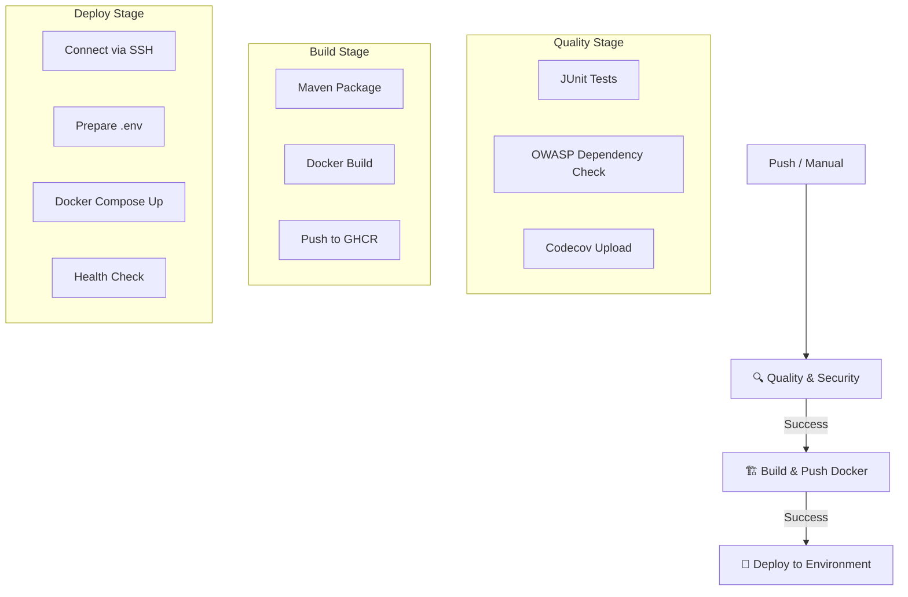

# Guía CI/CD: Backend INATrace

> **Audiencia**: DevOps, Desarrolladores Backend  
> **Componente**: Backend  
> **Última actualización**: Diciembre 2025

## Descripción General

El pipeline de CI/CD del backend de INATrace está diseñado para garantizar la calidad del código, la seguridad y el despliegue continuo en múltiples entornos y para múltiples cadenas de valor. Utiliza **GitHub Actions** como orquestador principal y **Docker** para la contenerización.

**Características principales**:
- **Multi-Entorno**: Soporte para Desarrollo, Testing (por cliente) y Producción.
- **Multi-Cadena**: Despliegues paralelos para diferentes productos (ej: Cacao, Camarón).
- **Seguridad**: Escaneo de dependencias (OWASP) y gestión de secretos.
- **Calidad**: Ejecución automática de pruebas unitarias e integración.
- **Registro**: Publicación de imágenes en GitHub Container Registry (GHCR).
- **Workflows Separados por Empresa**: Pipelines independientes para cada organización.

---

## Flujo del Pipeline (GitHub Actions)

El flujo de trabajo se dispara automáticamente en `push` a ramas clave o manualmente vía `workflow_dispatch`.



---

## Requisitos Previos

### Infraestructura
- Servidor Linux (Ubuntu recomendado) con:
  - Docker Engine 20.10+
  - Docker Compose v2+
  - Acceso SSH habilitado
- Puertos abiertos: 8080 (API), 3306 (MySQL, opcional externo)

### Repositorio
- Acceso a GitHub Actions.
- Token de acceso personal (PAT) con permisos de lectura/escritura de paquetes para GHCR.

---

## Arquitectura de Workflows Separados (Diciembre 2025)

A partir de diciembre 2025, el backend utiliza **workflows independientes por empresa/producto**, siguiendo mejores prácticas de DevOps.

### Estructura de Workflows

```
backend/.github/workflows/
├── deploy-backend-develop.yml    # 🚀 Development (Cacao + Shrimp)
├── deploy-backend-unocace.yml    # 🍫 Empresa 1 - staging + production
├── deploy-backend-dufer.yml      # 🦐 Empresa 2 - staging + production
└── (Jenkinsfile)                 # 🏛️ Alternativa Jenkins (si aplica)
```

### Flujo de Despliegue por Branch

| Branch | Workflow | Ambiente |
|--------|----------|----------|
| `develop` | `deploy-backend-develop.yml` | Dev Cacao + Shrimp |
| `staging` | `deploy-backend-{empresa}.yml` | Staging por empresa |
| `main` | `deploy-backend-{empresa}.yml` | Production por empresa |

### Beneficios de la Separación

| Aspecto | Beneficio |
|---------|-----------|
| **Aislamiento** | Un fallo en Empresa A no afecta a Empresa B |
| **Releases independientes** | Cada empresa tiene su propio calendario |
| **Trazabilidad** | Historial y logs separados por producto |
| **Escalabilidad** | Agregar empresa = crear nuevo workflow |

---

## Configuración de GitHub Actions

Cada workflow sigue la estructura: `quality` → `build` → `deploy-staging` → `deploy-production`.

### Inputs de Disparo Manual

| Input | Descripción | Opciones |
|-------|-------------|----------|
| `environment` | Entorno destino | `staging`, `production` |
| `skip_quality` | Omitir tests (Solo emergencias) | `true`, `false` |

### Variables de Entorno del Pipeline

| Variable | Valor Típico | Descripción |
|----------|--------------|-------------|
| `JAVA_VERSION` | `17` | Versión del JDK para build |
| `REGISTRY` | `ghcr.io` | Registro de contenedores |
| `IMAGE_NAME` | `[repo]-inatrace` | Nombre base de la imagen |

---

## Gestión de Secretos

El pipeline requiere los siguientes secretos configurados en GitHub (`Settings > Secrets and variables > Actions`):

### Credenciales Globales
- `GHCR_TOKEN`: Token para subir imágenes al registro.
- `CODECOV_TOKEN`: Token para subir reportes de cobertura (opcional).

### Credenciales por Entorno (Ejemplo: Desarrollo)

| Secreto | Descripción |
|---------|-------------|
| `DEV_HOST` | IP o Hostname del servidor |
| `DEV_USER` | Usuario SSH |
| `DEV_SSH_KEY` | Clave privada SSH |
| `DEV_DB_ROOT_PASSWORD` | Password root de MySQL |
| `DEV_DATASOURCE_PASSWORD` | Password del usuario de aplicación |
| `DEV_MAIL_PASSWORD` | Password para servidor SMTP |

> 💡 **Nota**: Para producción, se usan prefijos como `PROD_` o específicos por cliente (ej: `TEST_CLIENTE_HOST`).

---

## Estrategia de Despliegue

### 1. Preparación del Entorno Remoto
El pipeline se conecta vía SSH y asegura que existan los directorios necesarios:
```bash
/opt/inatrace/backend/[entorno]
/opt/inatrace/volumes/{uploads,import,documents,logs}
```

### 2. Generación Dinámica de `.env`
Se genera un archivo `.env` en tiempo de ejecución inyectando los secretos de GitHub. Esto evita tener credenciales en el repositorio.

**Ejemplo de generación**:
```bash
cat > .env <<EOF
IMAGE_NAME=ghcr.io/organizacion/backend-inatrace
TAG=latest
DATABASE_NAME=inatrace_prod
DATASOURCE_PASSWORD=${{ secrets.PROD_DATASOURCE_PASSWORD }}
...
EOF
```

### 3. Despliegue con Docker Compose
Se utiliza `docker-compose` para orquestar la actualización:
1. **Pull**: Descarga la nueva imagen.
2. **Stop/Remove**: Detiene el contenedor actual.
3. **Up**: Levanta el nuevo contenedor (recreación forzada).
4. **Healthcheck**: Script que consulta `/actuator/health` hasta recibir `200 OK` o timeout.

---

## Soporte Multi-Cadena (Stacks Paralelos)

Para soportar múltiples productos (ej: Cacao y Camarón) en el mismo servidor de desarrollo, el pipeline ajusta dinámicamente:

1. **Puertos Host**: 
   - Cacao: 8080
   - Camarón: 8081
2. **Nombres de Contenedor**: 
   - `inatrace-be-dev`
   - `inatrace-be-dev-shrimp`
3. **Bases de Datos**:
   - `inatrace_dev`
   - `inatrace_shrimp_dev`

Esto permite pruebas aisladas de nuevas funcionalidades específicas por cadena.

---

## Pipeline Alternativo: Jenkins

Existe un `Jenkinsfile` para entornos que requieren despliegue desde una infraestructura on-premise o alternativa a GitHub Actions.

**Diferencias clave**:
- Usa agentes Jenkins locales.
- Despliegue vía SSH similar, pero gestionado por credenciales de Jenkins.
- Incluye paso de **Backup de Base de Datos** automático antes de desplegar en producción.

En cuanto a configuración, la lógica de variables y secretos es coherente con las plantillas estándar de GitHub Actions:

- La **matriz de variables sensibles** (host, usuario SSH, credenciales de BD, correo, usuario administrador, etc.) se define de forma neutral en [variables-secrets-template.md](../despliegue/variables-secrets-template.md).  En entornos con Jenkins estas variables se gestionan como **credenciales de Jenkins** y se materializan en ficheros `.env`, según se describe en [manual-jenkins-instalacion-configuracion.md](../../docs/tecnico/manual-jenkins-instalacion-configuracion.md).
- La estructura de despliegue por empresa/entorno es análoga a la de los workflows de GitHub Actions documentados en [plantilla-workflow-backend-empresa.md](../despliegue/plantilla-workflow-backend-empresa.md); la diferencia es únicamente el orquestador (Jenkins en lugar de GitHub Actions) y el mecanismo de inyección de secretos.

---

## Troubleshooting de Despliegue

### Error: Healthcheck Failed
**Síntoma**: El despliegue falla con "Health check failed after X minutes".
**Causa**: La aplicación tarda demasiado en arrancar o falla al iniciar.
**Acción**:
1. Conectarse al servidor por SSH.
2. Ver logs: `docker logs inatrace-be --tail 100`.
3. Verificar conexión a BD (causa común de demora).

### Error: Unauthorized (401) en GHCR
**Causa**: El token de GitHub ha expirado o no tiene permisos de `write:packages`.
**Acción**: Regenerar PAT en GitHub y actualizar el secreto `GHCR_TOKEN`.

### Error: Database Migration Failed
**Causa**: Conflicto en checksums de Flyway (modificación de migración ya aplicada).
**Acción**:
- **Dev**: `mvn flyway:repair` o limpiar BD.
- **Prod**: Verificar manualmente la tabla `flyway_schema_history`.

---

## Recursos Adicionales

- [Ficha Técnica Backend](./ficha-tecnica-backend.md)
- [Configuración de Variables](./configuracion.md)
- [Repositorio de Código](https://github.com/Atijaguar-ec/backend)

---

**Última actualización**: Noviembre 2025
