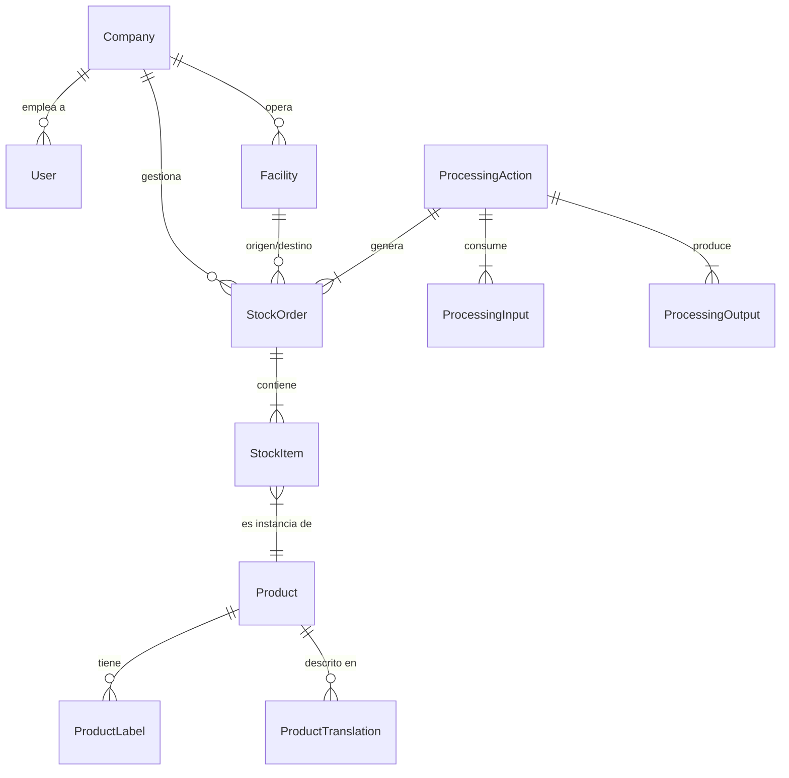

# Modelo de Datos INATrace

> **Audiencia**: Arquitectos de Datos, Desarrolladores Backend, DBAs  
> **Componente**: Base de Datos (MySQL)  
> **Última actualización**: Noviembre 2025

## Descripción General

El modelo de datos de INATrace está diseñado para soportar trazabilidad compleja, múltiples cadenas de valor y aislamiento multi-organizacional (multi-tenancy) dentro de un esquema relacional unificado. Se implementa sobre **MySQL 8.0** y utiliza **Hibernate** como ORM.

**Características principales**:
- **Diseño Centrado en Trazabilidad**: Modelo de eventos para registrar el flujo de productos (Entrada -> Proceso -> Salida).
- **Multi-Tenancy Lógico**: Todas las tablas principales están particionadas lógicamente por `company_id`.
- **Auditoría Completa**: Tablas espejo (`_AUD`) gestionadas por Hibernate Envers para historial inmutable.
- **Extensibilidad**: Uso de tablas de traducción y configuración dinámica de campos.

---

## Diagrama Conceptual (ERD Simplificado)

## Diagrama Entidad-Relación Completo

El diagrama completo del esquema de base de datos muestra todas las tablas, relaciones y cardinalidades:

> 💡 **Nota**: Este diagrama fue generado automáticamente desde el esquema de MySQL. Incluye todas las tablas de auditoría (`_AUD`) y tablas de traducción.

---

## Dominios Principales

### 1. Gestión Organizacional (Core)

Estas entidades definen quién opera en el sistema y qué estructura tiene.

| Entidad | Descripción |
|---------|-------------|
| `Company` | Organización o cooperativa. Raíz del multi-tenancy. |
| `User` | Usuarios del sistema (autenticación). |
| `CompanyUser` | Relación Usuario-Empresa con roles específicos (ADMIN, MANAGER). |
| `Facility` | Ubicaciones físicas (Centros de acopio, Laboratorios, Plantas). |

### 2. Trazabilidad y Stock

El núcleo del negocio. Registra el movimiento y transformación de bienes.

| Entidad | Descripción |
|---------|-------------|
| `StockOrder` | Documento maestro de movimiento (Compra, Venta, Traslado, Proceso). |
| `StockItem` | Detalle de la orden. Representa un lote físico específico. |
| `Batch` | Identificador único de trazabilidad que agrupa items con mismo origen. |
| `ProcessingAction` | Registro de una transformación (ej: Secado, Fermentación). |

**Modelo de Eventos de Trazabilidad**:
La trazabilidad se construye encadenando `StockOrders`:
1. **Orden de Recepción** (Crea Lote A)
2. **Orden de Proceso** (Consume Lote A -> Produce Lote B)
3. **Orden de Venta** (Despacha Lote B)

### 3. Catálogo de Productos

Definición de qué se está trazando.

| Entidad | Descripción |
|---------|-------------|
| `Product` | Definición maestra (Cacao Seco, Camarón Entero). |
| `ProductType` | Categoría (Materia Prima, Producto en Proceso, Producto Final). |
| `ProductLabel` | Configuración de etiquetas QR públicas. |

---

## Patrones de Diseño de Datos

### 1. Multi-Tenancy por Columna
Casi todas las tablas transaccionales tienen una columna `company_id`.
- **Regla**: Cada consulta debe filtrar por `company_id` del usuario activo.
- **Ventaja**: Permite reportes consolidados y mantenimiento simplificado.
- **Seguridad**: Hibernate Filters o cláusulas `WHERE` mandatorias en repositorios.

### 2. Auditoría (Envers)
Por cada tabla crítica (ej: `StockOrder`), existe una tabla `StockOrder_AUD`.
- **Contenido**: Copia del registro + Tipo de Cambio (INS, UPD, DEL) + Timestamp + Usuario.
- **Uso**: Permite reconstruir el estado exacto del sistema en cualquier punto del pasado.

### 3. Internacionalización (i18n)
Las entidades de catálogo usan el patrón de tabla de traducción.

**Ejemplo**:
- `processing_action_type` (ID, codigo)
- `processing_action_type_translation` (ID, type_id, language_code, name, description)

---

## Tablas Clave y sus Campos

### Tabla `StockOrder` (Movimientos)

| Campo | Tipo | Descripción |
|-------|------|-------------|
| `id` | BIGINT | PK |
| `uuid` | CHAR(36) | Identificador global único (para QR/API). |
| `company_id` | BIGINT | Dueño del movimiento. |
| `facility_id` | BIGINT | Ubicación donde ocurre. |
| `status` | ENUM | `DRAFT`, `COMPLETED`, `CANCELLED`. |
| `transaction_date` | DATETIME | Fecha real del evento. |
| `moisturePercentage` | DECIMAL | % Humedad (Crítico en agrícolas). |
| `moistureWeightDeduction`| DECIMAL | Peso descontado por humedad. |

### Tabla `user` (Usuarios)

| Campo | Tipo | Descripción |
|-------|------|-------------|
| `id` | BIGINT | PK |
| `email` | VARCHAR | Identificador de login (único). |
| `password` | VARCHAR | Hash BCrypt. |
| `status` | ENUM | `PENDING`, `ACTIVE`, `DISABLED`. |
| `role` | ENUM | Rol global (`SYSTEM_ADMIN`, `USER`). |

---

## Extensiones Recientes (INATrace 2)

1. **Soporte de Monedas**:
   - Nuevas tablas para manejar tasas de cambio históricas.
   - `currency_exchange_rate` (currency_from, currency_to, rate, date).

2. **Campos Dinámicos de Evidencia**:
   - `processing_evidence_field`: Define qué datos capturar en un proceso (Temp, PH).
   - `processing_evidence_value`: Almacena los valores capturados por lote.

---

## Recursos Adicionales

- [Diccionario de Datos](./diccionario-datos.md)
- [Guía de Migraciones](./migraciones.md)
- [Diagrama ERD Completo](./diagrama-erd.md)

---

**Última actualización**: Noviembre 2025
