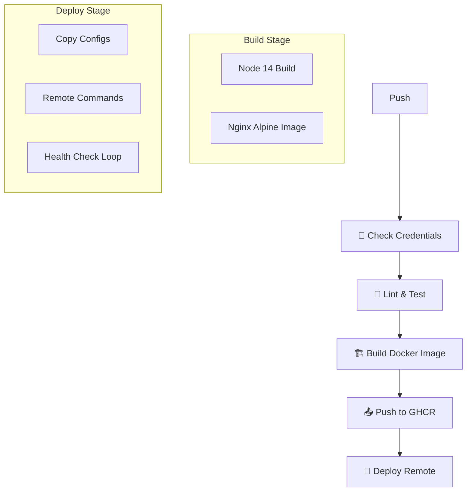

# Guía CI/CD: Frontend INATrace

> **Audiencia**: DevOps, Desarrolladores Frontend  
> **Componente**: Frontend  
> **Última actualización**: Noviembre 2025

## Descripción General

El pipeline de CI/CD del frontend de INATrace automatiza la construcción, prueba y despliegue de la aplicación Angular. Utiliza **GitHub Actions** como orquestador principal, generando imágenes Docker optimizadas con Nginx para servir la aplicación de manera eficiente.

**Características principales**:
- **Construcción Docker Multi-Stage**: Imagen final ligera basada en Alpine Linux.
- **Entornos Dinámicos**: Soporte para Preproducción (Staging) y Producción.
- **Configuración Runtime**: Inyección de variables de entorno (API URL, Tema) al iniciar el contenedor, sin recompilar.
- **Verificación de Calidad**: Linting y Pruebas Unitarias (Headless Chrome).
- **Despliegue Sin Caída**: Uso de `docker-compose` con recreación orquestada.

---

## Flujo del Pipeline



---

## Requisitos Previos

### Entorno de Construcción
- Node.js 14 (definido en `env.NODE_VERSION`).
- Docker Buildx habilitado.

### Entorno de Despliegue (Servidor)
- Docker Engine y Docker Compose.
- Puerto HTTP expuesto (típicamente 80 o mapeado vía proxy reverso).
- Acceso SSH para el usuario de despliegue.

---

## Configuración del Workflow

El archivo principal es `.github/workflows/deploy-frontend.yml`.

### Variables de Entorno Clave

| Variable | Descripción | Ejemplo |
|----------|-------------|---------|
| `NODE_VERSION` | Versión de Node para build | `14` |
| `REGISTRY` | Registro de imágenes | `ghcr.io` |
| `HEALTH_MAX_RETRIES` | Intentos de healthcheck | `12` |

### Entornos Definidos

1. **Producción (`main`)**
   - Rama: `main`
   - URL API: Producción (`https://inatrace.example.com/api`)
   - Tag Docker: `latest`

2. **Preproducción (`staging`)**
   - Rama: `staging`
   - URL API: Test (`https://test-api.example.com/api`)
   - Tag Docker: `test-[commit-hash]`

---

## Proceso de Construcción (Docker)

El `Dockerfile` utiliza un enfoque de múltiples etapas para minimizar el tamaño de la imagen:

### Etapa 1: Build (Node.js)
1. Instala dependencias (`npm install`).
2. Ejecuta el build de Angular en modo producción (`npm run build:prod`).
3. Genera los artefactos estáticos en `dist/`.

### Etapa 2: Runtime (Nginx)
1. Parte de `nginx:alpine`.
2. Copia los artefactos desde la Etapa 1.
3. Copia la configuración personalizada de Nginx (`nginx.conf`).
4. Exponé el puerto 80.

---

## Configuración en Tiempo de Ejecución (Runtime)

A diferencia de las apps Angular tradicionales que "queman" la configuración en el build, INATrace utiliza un archivo `assets/env.js` que se genera o reemplaza al iniciar el contenedor.

Esto permite usar **la misma imagen Docker** para diferentes entornos (Dev, Test, Prod) o diferentes cadenas (Cacao, Camarón).

**Script de entrada (`remote-deploy.sh`)**:
```bash
# El pipeline inyecta estas variables en el archivo .env del servidor
echo "window.env = {" > assets/env.js
echo "  apiUrl: '${API_URL}'," >> assets/env.js
echo "  companyTheme: '${COMPANY_THEME}'," >> assets/env.js
echo "};" >> assets/env.js
```

---

## Estrategia de Despliegue Remoto

El pipeline ejecuta los siguientes pasos en el servidor destino:

1. **Transferencia de Archivos**:
   - `docker-compose.yml`: Definición del servicio.
   - `nginx.conf`: Configuración del servidor web.
   - `.env`: Variables específicas del despliegue actual.
   - `remote-deploy.sh`: Script orquestador.

2. **Ejecución Remota**:
   - Crea redes Docker si no existen (`inatrace-frontend-network`).
   - Descarga la imagen actualizada (`docker compose pull`).
   - Recrea el contenedor (`docker compose up -d --force-recreate`).

3. **Verificación (Healthcheck)**:
   - Realiza peticiones `curl` internas o externas al endpoint de salud.
   - Si falla tras N intentos, el pipeline marca error y muestra logs.

---

## Plantillas estándar para secrets y despliegue multi‑empresa

La configuración de secretos y despliegue por empresa en el frontend está alineada con las plantillas generales utilizadas en el backend:

- La **lista neutralizada de secrets** para todos los entornos (incluyendo `STAGE_FE_{COMPANY}_*` y `PROD_FE_{COMPANY}_*` para frontend) se documenta en `../despliegue/variables-secrets-template.md`. Allí se definen los patrones de nombres recomendados para servidores, usuarios SSH y credenciales asociadas a cada compañía.
- La estructura de **jobs de despliegue por empresa** para frontend (por ejemplo, `deploy-test-{company_code}` y `deploy-prod-{company_code}`) se describe en `../despliegue/plantilla-workflow-frontend-empresa.md`, que explica cómo reutilizar el archivo de plantilla técnica `fe/.github/workflows/deploy-frontend-company-template.yml` mediante placeholders (`{COMPANY_CODE}`, `{company_code}`, `{company-domain}`).

De este modo, la documentación de frontend mantiene la misma línea que la del backend: una sola matriz de variables sensibles y un conjunto de plantillas estándar que pueden adaptarse a cualquier organización que opere INATrace.

---

## Troubleshooting

### Error: `node-sass` en Build
**Síntoma**: Fallo en `npm install` relacionado con bindings.
**Causa**: Incompatibilidad de versión Node.
**Solución**: El pipeline fuerza el uso de `node:14-alpine`. Asegurarse de no actualizar Node sin probar compatibilidad de `node-sass`.

### Error: Healthcheck Timeout
**Síntoma**: El despliegue finaliza con error tras esperar.
**Causa**: Nginx no arranca o configuración SSL inválida.
**Acción**:
1. Revisar logs: `docker logs inatrace-fe-prod --tail 50`.
2. Verificar sintaxis de `nginx.conf`.

### Error: Pantalla Blanca (Runtime Error)
**Síntoma**: La app carga pero se queda en blanco.
**Causa**: Error en `env.js` (sintaxis) o fallo de conexión API.
**Acción**: Abrir consola del navegador (F12) y verificar si `window.env` está definido correctamente.

---

## Recursos Adicionales

- [Ficha Técnica Frontend](./ficha-tecnica-frontend.md)
- [Configuración de Temas](./configuracion-temas.md)
- [Repositorio Frontend](https://github.com/Atijaguar-ec/fe)

---

**Última actualización**: Noviembre 2025
